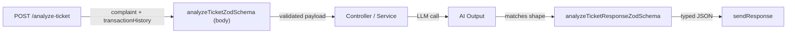

## Plan: Update Support Ticket Zod Schemas

TL;DR: Refactor `supportTicket.validation.ts` Zod schemas only to match the new AI ticket analysis data structures (evidence verdict, case type, severity, department, agent summary, customer reply, next action, relevant transaction, confidence, reason codes). Keep all TS interfaces, services, controllers, and routes untouched.

**Steps**
1. **Inventory existing schemas** — open `supportTicket.validation.ts` and list every exported Zod schema and enum so the refactor is exhaustive. (depends on 0)
2. **Add new enums** — add `evidenceVerdictEnum` (`consistent` | `inconsistent` | `insufficient_data`), `caseTypeEnum` (Wrong Transfer, Refund, Payment Failed, Phishing, Account Issue, Billing Issue, Other), `departmentEnum` (Dispute Resolution, Payments Ops, Fraud Risk, Account Team, Billing Team, Support Team), keep `ticketLevelEnum` for severity, and a `reasonCodesEnum` (string array). (depends on 1, parallel with 3)
3. **Rewrite `createSupportTicketZodSchema`** — body accepts the analyze-ticket payload: `ticketId` (string, optional — generate if missing), `complaint` (string, min 1, max 5000), `transactionHistory` (array of objects with `transactionId`, `type`, `amount`, `status`, `timestamp` etc.). (depends on 1)
4. **Add `analyzeTicketResponseZodSchema`** — for documenting/shaping the AI response payload: `ticketId`, `relevantTransactionId`, `evidenceVerdict`, `caseType`, `severity`, `department`, `agentSummary`, `recommendedNextAction`, `customerReply`, `humanReviewRequired`, `confidence` (0..1), `reasonCodes` (string[]). Export an inferred type alias. (depends on 2, parallel with 3)
5. **Update `updateSupportTicketZodSchema`** — body keeps existing `status`/`type`/`adminNote`/`aiConfidence` and adds optional `evidenceVerdict`, `caseType`, `department`, `agentSummary`, `customerReply`, `recommendedNextAction`, `reasonCodes` (string[]), `relevantTransactionId`. (depends on 2)
6. **Update `listSupportTicketsZodSchema` query** — add optional filters `caseType`, `department`, `evidenceVerdict`. (depends on 2)
7. **Export inferred types** — add `AnalyzeTicketInput`, `AnalyzeTicketResponse`, `EvidenceVerdict`, `CaseType`, `Department` type aliases from the new schemas. (depends on 3, 4, 5)

**Relevant files**
- `src/app/module/SupportTicket/supportTicket.validation.ts` — rewrite schemas/enums to match new analyze-ticket JSON shape

**Diagrams**

**Verification**
1. `npm run lint` — ensure no lint errors in the validation file.
2. `npx tsc -p . --noEmit` — type-check that all inferred types still resolve and any consumer types (controllers/services) remain compatible (since interfaces weren't changed, TS should still compile; warnings only if type aliases overlap).
3. Manual diff review — confirm all new fields listed by the user are present: `ticket_id`, `relevant_transaction_id`, `evidence_verdict`, `case_type`, `severity`, `department`, `agent_summary`, `recommended_next_action`, `customer_reply`, `human_review_required`, `confidence`, `reason_codes`.
4. (Optional) `npm run dev` and `curl http://localhost:8000/api/v1/tickets` with the new body to confirm Zod parsing succeeds on a sample payload.
